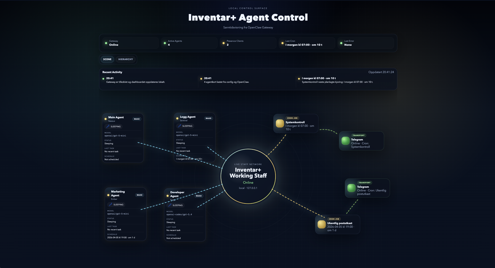
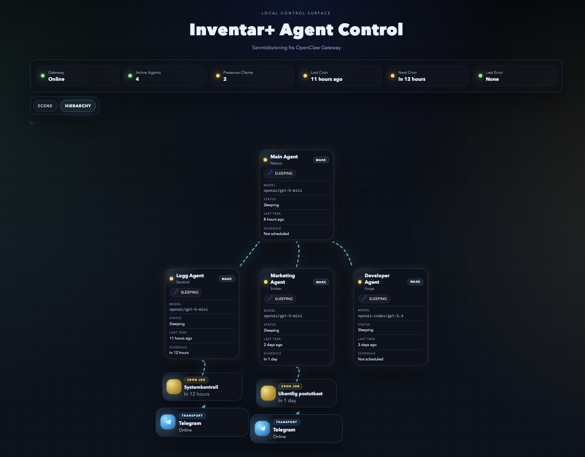
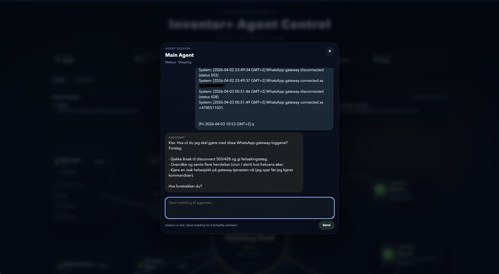

# OpenClaw Dashboard

A lightweight local dashboard for OpenClaw Gateway, designed to run on the same Ubuntu server as OpenClaw.

This project works as an internal control panel for agents, cron jobs, transports, live activity, and agent chat.

## Screenshots

### Overview


### Hierarchy View


### Agent Chat


## What it does

- Reads local settings from `config.json`
- Fetches status and metadata from OpenClaw through the local CLI and Gateway
- Displays agents, cron jobs, transports, activity, and chat in a local web UI
- Supports both `Scene` and `Hierarchy` views
- Pushes updates to the frontend with SSE
- Keeps the OpenClaw gateway token on the server side instead of exposing it in the browser
- Works over localhost or an internal LAN

## Features

- Live gateway and agent overview
- Agent cards with custom labels and display names
- Scene view for topology-style monitoring and manual placement
- Hierarchy view for structured org-chart style layouts
- Cron job visibility and transport mapping
- Transport visibility for integrations such as WhatsApp and Telegram
- Built-in agent chat panel
- Config-driven labels and mapping
- Local-first architecture with OpenClaw kept behind the dashboard backend

## How it works

The dashboard runs as its own local web server on port `3000`.

OpenClaw Gateway runs separately and typically listens locally on:

- `127.0.0.1:18789`

The dashboard talks to OpenClaw on the server side through CLI and Gateway calls. That means the gateway token is never sent to the frontend.

Typical layout:

- Dashboard: `0.0.0.0:3000` or `127.0.0.1:3000`
- OpenClaw Gateway: `127.0.0.1:18789`

## OpenClaw calls used by the dashboard

The dashboard uses calls such as:

- `openclaw health --json`
- `openclaw status --json`
- `openclaw system presence --json`
- `openclaw cron list --all --json`
- `openclaw agents list --json`
- `openclaw logs --json`

Depending on the current UI mode and features in use, the backend may also read agent- and session-related data.

## Why this architecture

OpenClaw Gateway uses WebSocket plus authentication in the connection flow. The gateway should therefore stay local and should not be exposed directly unless you explicitly want that.

This dashboard keeps the gateway behind the server and lets the backend perform the OpenClaw calls. That gives:

- a simpler frontend
- less token exposure
- cleaner separation between dashboard and gateway
- safer internal operation

## Requirements

- Ubuntu server
- Python 3
- OpenClaw installed and working
- OpenClaw Gateway running locally
- A valid gateway token if your gateway uses `gateway.auth.token`

## Setup on Ubuntu

1. Copy this project folder to your server.
2. Create your local config:

```bash
cp config.example.json config.json
```

3. Edit `config.json` and set the correct `gatewayUrl` and `token`.
4. Start the dashboard:

```bash
cd /path/to/Openclaw_dashboard
python3 server.py
```

## Access options

### Localhost access

If the dashboard runs on localhost:

```text
http://127.0.0.1:3000
```

### Internal LAN access

If the dashboard listens on `0.0.0.0` and is reachable on your internal network:

```text
http://SERVER_IP:3000
```

### SSH tunnel access

If you prefer SSH forwarding:

```bash
ssh -L 18789:127.0.0.1:18789 -L 3000:127.0.0.1:3000 USER@SERVER_IP
```

Then open:

```text
http://127.0.0.1:3000
```

## Important note about the gateway token

If your OpenClaw Gateway uses `gateway.auth.token`, the same token must be added to `config.json`.

The dashboard uses this token only on the server side when calling OpenClaw through the local CLI and Gateway.

## Example config

See `config.example.json` for the full template.

Minimal example:

```json
{
  "server": {
    "host": "0.0.0.0",
    "port": 3000
  },
  "openclaw": {
    "cliPath": "openclaw",
    "gatewayUrl": "ws://127.0.0.1:18789",
    "token": "SET_GATEWAY_TOKEN_HERE",
    "timeoutMs": 5000,
    "pollIntervalMs": 5000
  }
}
```

## What the config controls

### `server`

Controls where the dashboard listens.

Examples:

- `127.0.0.1` = local only
- `0.0.0.0` = reachable on internal network interfaces

Fields:

- `host`
- `port`

### `openclaw`

Controls how the dashboard talks to OpenClaw.

Fields:

- `cliPath` = path or command name for the OpenClaw CLI
- `gatewayUrl` = local gateway URL
- `token` = gateway token
- `timeoutMs` = timeout for OpenClaw calls
- `pollIntervalMs` = base interval used by dashboard logic

### `dashboard`

Controls labels, visual settings, and how cards connect to OpenClaw data.

Fields:

- `title` = page title
- `subtitle` = page subtitle
- `activityItems` = number of activity items to show
- `whatsapp.cronJobIds` = cron jobs linked to the WhatsApp transport node
- `agentCards` = cards shown in the dashboard UI

### `agentCards`

Each card can be linked to a real OpenClaw agent with:

- `id` = local dashboard ID
- `label` = card label in the UI
- `name` = displayed agent name
- `openclawId` = actual OpenClaw agent ID
- `cronJobIds` = optional list of cron jobs associated with that card

## Running as a systemd user service

Example service file:

```ini
[Unit]
Description=OpenClaw Dashboard
After=network.target

[Service]
Type=simple
WorkingDirectory=/opt/openclaw-dashboard
ExecStart=/usr/bin/python3 /opt/openclaw-dashboard/server.py
Restart=always
RestartSec=5

[Install]
WantedBy=default.target
```

## Example installation as a user service

Create the service file:

```bash
mkdir -p ~/.config/systemd/user
nano ~/.config/systemd/user/openclaw-dashboard.service
```

Reload and start it:

```bash
systemctl --user daemon-reload
systemctl --user enable openclaw-dashboard.service
systemctl --user start openclaw-dashboard.service
```

Check status:

```bash
systemctl --user status openclaw-dashboard.service --no-pager -l
```

If you want user services to survive reboot without requiring an active login session:

```bash
sudo loginctl enable-linger $USER
```

## Security principles

- The dashboard may be exposed internally if needed
- OpenClaw Gateway should remain localhost-only unless you explicitly choose otherwise
- This project is intended as an internal control panel
- Do not put the gateway token into frontend code
- Do not expose OpenClaw Gateway directly unless you really need it
- Internal VLAN or network segmentation is still recommended

## Typical use case

This project fits setups where you want:

- a simpler overview than the default OpenClaw UI
- custom-named agent cards
- visibility into agents, cron jobs, transports, and live activity
- scene- or hierarchy-based visualization
- local agent chat in the same dashboard
- a config-driven control panel without extra infrastructure

## Roadmap ideas

- real parent/child support in hierarchy view
- child agent grouping under manager agents
- manual layout overrides through `config.json`
- richer transport mapping
- better scene persistence
- optional auth layer for internal LAN deployments
- cleaner packaging for public GitHub release

## Notes

- This project was built for a real local OpenClaw setup and can be adapted through `config.json`
- Dashboard behavior depends on your own OpenClaw agents, cron jobs, and transports
- Scene and hierarchy behavior, labels, and transport mapping are driven by config plus live OpenClaw data

